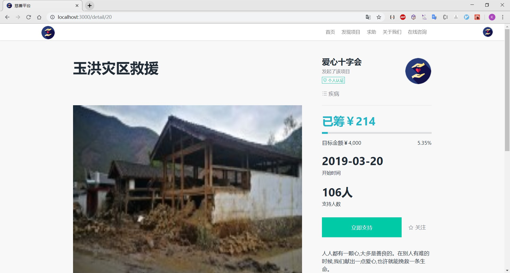
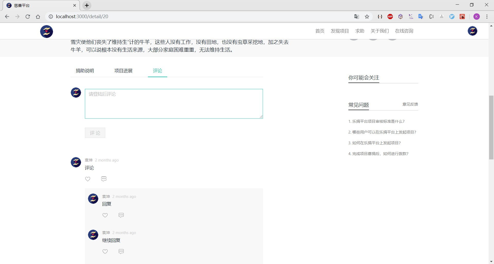
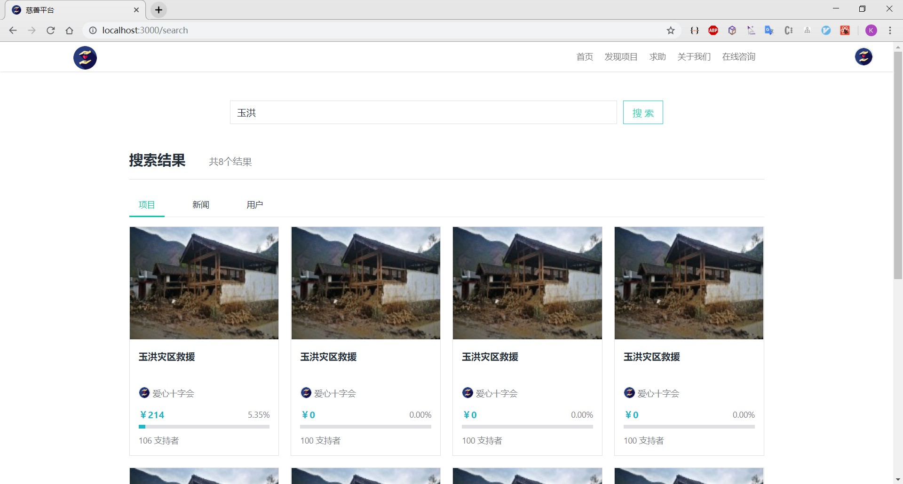
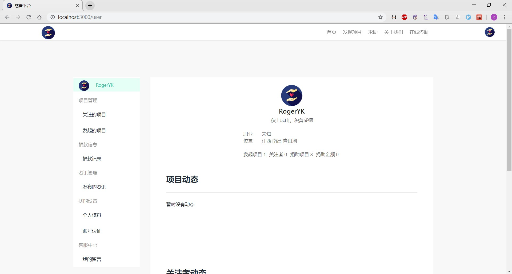
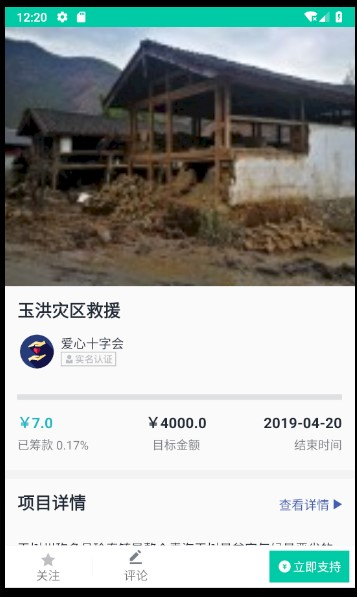
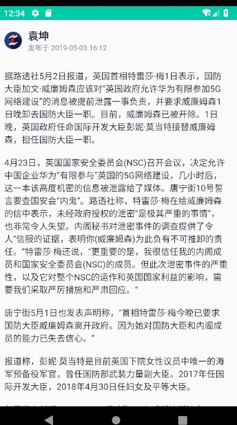
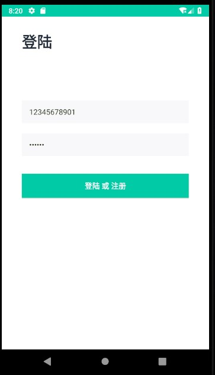
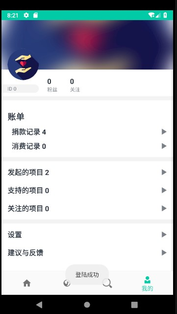
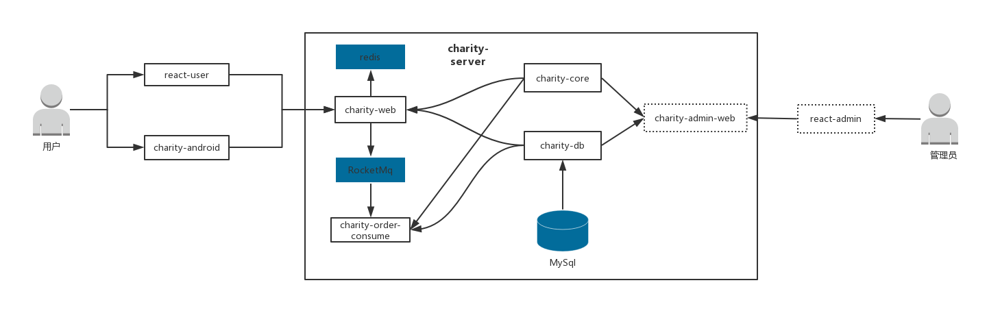

# 慈善平台

[](https://github.com/Rogeryk)
[](https://github.com/RogerYK/http-down/blob/master/LICENSE)  

> 该项目是一个依托于区块链实现的慈善平台，致力于使用区块链来实现捐款信息的公开透明，同时利用区块链的智能合约，来规范善款的正确使用。

## 项目演示

### 桌面前端










### Android端











## 项目结构

```
.
+-- doc 文档信息
+-- charity-android  #android客户端
+-- react-user # 桌面web客户端
+-- charity-server # 服务端
+   +-- charity-db # 数据库实体类以及访问层方法
+   +-- charity-core # 消息类，异常以及一些通用代码
+   +-- charity-web # 前端web层
+   +-- charity-order-consumer # 订单消费者
.
```

## 技术选型

### 后端技术

技术 | 说明 | 官网
---|---|---
Spring Boot | 容器+自动配置 | <https://spring.io/projects/spring-boot/>
Spring MVC | Web框架 | <https://docs.spring.io/spring/docs/current/spring-framework-reference/web.html>
Spring data jpa | ORM框架 | <https://spring.io/projects/spring-data-jpa>
Hibernator-Validator | 验证框架 | <https://hibernate.org/validator/documentation/>
RocketMq | 消息队列 | <http://rocketmq.apache.org/>
Lombok | java数据类工具 | <https://projectlombok.org/>

### 桌面前端

技术 | 说明 | 官网
---|---|---
react | 界面框架 | <https://www.reactjs.org/>
react-router-dom | 前端路由 | <https://reacttraining.com/react-router/>
ant design | 界面组件库 | <https://ant.design/index-cn>
axios | http框架 | <https://github.com/axios/axios>
react-quill | react富文本编辑器 | <https://github.com/zenoamaro/react-quill>
mobx | 状态管理框架 | <https://cn.mobx.js.org/>

### Android 

待做

## 架构图

### 系统架构



## 开发环境

 工具 | 版本
---|---
JDK | 1.8
MySql | 8.0
Redis | 3.2.1
RocketMq | 3.7.14

## 许可证

[Apache License 2.0](https://github.com/RogerYK/charity-all/blob/License)
